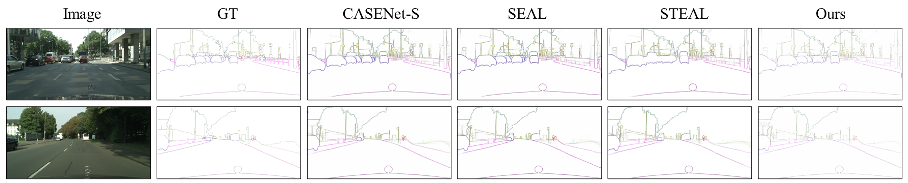

# PNT-Edge: Towards Robust Edge Detection with Noisy Labels by Learning Pixel-level Noise Transitions

*Wenjie Xuan, Shanshan Zhao, Yu Yao, Juhua Liu, Tongliang Liu,  Yixin Chen, Bo Du, Dacheng Tao*, *accepted by ACM MM-2023*

[Paper](https://arxiv.org/abs/2307.14070) | [Method](#method) | [Visualization](#visualized-results) | [Models](#model-parameters) | [Getting Started](#getting-started) | [FAQ](#frequently-asked-questions) | [Citation](#citation) 


## Method


***Abstract:*** Relying on large-scale training data with pixel-level labels, previous edge detection methods have achieved high performance. However, it is hard to manually label edges accurately, especially for large datasets, and thus the datasets inevitably contain noisy labels. This label-noise issue has been studied extensively for classification, while still remaining under-explored for edge detection. To address the label-noise issue for edge detection, this paper proposes to learn Pixel-level Noise Transitions to model the label-corruption process. To achieve it, we develop a novel Pixel-wise Shift Learning (PSL) module to estimate the transition from clean to noisy labels as a displacement field. Exploiting the estimated noise transitions, our model, named PNT-Edge, is able to fit the prediction to clean labels. In addition, a local edge density regularization term is devised to exploit local structure information for better transition learning. This term encourages learning large shifts for the edges with complex local structures. Experiments on SBD and Cityscapes demonstrate the effectiveness of our method in relieving the impact of label noise. 


## Visualized Results

|  Dataset   |                      Visualized Results                      |
| :--------: | :----------------------------------------------------------: |
|    SBD     |  |
| Cityscapes |  |
| *BSDS500*  |  |

> In this paper, we mainly focus on semantic edge (instance-sensitive) in SBD and Cityscapes. To further validate our method, we also test it on general edge detection dataset, i.e., BSDS500. If you want to know more details, please refer to our [paper](https://arxiv.org/abs/2307.14070) and the [supplementary](https://arxiv.org/abs/2307.14070) materials. 


## Model Parameters

1. Pretrained models of CASENet: We use the pretrained models provided by [github](https://github.com/anirudh-chakravarthy/CASENet), which converted the official caffe weights to pytorch. For convenience, we provide the converted pytorch parameters we use. You can also refer to the original project [github](https://github.com/anirudh-chakravarthy/CASENet), which provide a detailed instruction of how to convert CASENet parameters from caffe to pytorch. 

   |   Models   |                Pretrained CASENet in Pytorch                 |
   | :--------: | :----------------------------------------------------------: |
   |    sbd     | [Baidu Yun](https://pan.baidu.com/s/1do8Eia7oKSKBisuLGkKyBw?pwd=2023), key=`2023` |
   | cityscapes | [Baidu Yun](https://pan.baidu.com/s/1u3m0GcTBXoDy8GRIOu56tw?pwd=2023), key=`2023` |

2. The parameters of our PNT-Edge model on SBD and Cityscapes dataset can be downloaded here. 

   |   Models   |                         Warmup Model                         |                         Final Model                          |
   | :--------: | :----------------------------------------------------------: | :----------------------------------------------------------: |
   |    sbd     | [Baidu Yun](https://pan.baidu.com/s/1jjqxCJRTT0JYpBO7Rz7T5w?pwd=2023), key=`2023` | [Baidu Yun](https://pan.baidu.com/s/1bY95o-Xz4_SQsqDhyvAyIw?pwd=2023), key=`2023` |
   | cityscapes | [Baidu Yun](https://pan.baidu.com/s/1ba28TEU6CNJM7lcTxTvUag?pwd=2023), key=`2023` | [Baidu Yun](https://pan.baidu.com/s/133PAPs_9Jrtyr5q92z4OlA?pwd=2023), key=`2023` |


## Getting Started

1. Clone the project. 

   ```shell
   # clone our project
   git clone https://github.com/DREAMXFAR/PNT-Edge.git
   cd PNT-Edge-master/

2. Prepare the conda environment. We implement with `torch 1.8.1` and `cuda 11.1` on `NVIDIA 3090`. For convenience, we provide the `requirements.txt` for reference. 

   ```shell
   # run the scripts to install packages 
   pip install -r requirements.txt
   ```

### Notation

We have provided a simple dataset with only one image and according labels and training-pair list in `./examples`, so you can just run our code according to the default settings for a quick reference. It also provide an example of how to organize the data  for training and testing. You can also directly run the following scripts for [Training](#training), [Inference](#inference) and [Evaluation](#evaluation) for quick tutorial. 

### Data

1. Prepare the SBD dataset and Cityscapes dataset. **We highly recommend you to follow the step-by-step data processing instructions according to [SEAL.Part 1: Pre-processing](https://github.com/Chrisding/seal#part-1-preprocessing).** Here we summarize the main steps for quick reference. Note that Matlab is needed for pre-processing.  

   - Step 1: Prepare the SBD dataset. 

     ```shell
     # 1. download the dataset provided by Chrisding from Google Drive or Baidu Yun. 
     # 2. unzip the data
     tar -xvzf data_orig/sbd.tar.gz -C data_orig && rm data_orig/sbd.tar.gz
     # 3. perform data augmentation and generate labels. In Matlab Command Window: 
     run code/demoPreproc.m
     # 4. generate edge ground-truth for test. In Matlab Command Window: 
     run code/demoGenGT.m
     # 5. download the clean labels provided by Chrisding. 
     tar -xvzf gt_eval/gt_reanno.tar.gz -C gt_eval && rm gt_eval/gt_reanno.tar.gz

   - Step 2: Prepare the Cityscapes dataset. The steps is similar to that on SBD dataset. Please refer to [SEAL.Part 1: Pre-processing](https://github.com/Chrisding/seal#part-1-preprocessing) for detailed implementation and the dataset links on Google Drive and Baidu Yun. Note that there are no clean labels provided on Cityscapes. 

   - Step 3: Configure the dataset path in `./prep_dataset/prep_sbd_dataset.py` and `./prep_dataset/prep_cityscapes_dataset.py`. 

     ```python
     # set the image and label path in funtction get_dataloader() and get_my_dataloader() to the sbd and cityscapes data. 
     root_img_folder = r"./example/"
     root_label_folder = r"./example/"

2. Generate the Canny edges offline, which is used to estimate the local edge density for PSL training.  

   - Step 1: Configure the image directory path, i.e., `dir_name, image_root, save_root` and run `./myCode/edge_process/opencv_canny.py` to generate Canny edges in `$CANNY_PATH`. 
   - Step 2: Change the `self.canny_path=$CANNY_PATH` in `./dataloader.py/sbd_data.py` and  `./dataloader.py/cityscapes_data.py`. 

3. Create the image-groundtruth name list for training and test. 

   - Step 1: Prepare the image-groundtruth name list in the following format for training and test. Here is an example in `./example/debug_single.txt` and `./example/debug_text.txt`.  

     ```python
     # trianing.txt: image path, label path
     /image/test/2008_000075.png /label_inst_orig/test/2008_000075.mat
     # test.txt: image_path
     /image/test/2008_000075.png

   - Step 2: Configure the name list path `train_anno_txt` to your own in `./prep_dataset/prep_sbd_dataset.py` and `./prep_dataset/prep_cityscapes_dataset.py`. 

### Training

> Here we suppose you are in `PNT-Edge_master/`

0. Download the pretrained pytorch CASENet parameter in [Model Parameters](#model-parameters) in `./pretrained_models`. And download our released models in `./release_model_params/sbd` and `./release_model_params/cityscapes`. 

1. Warm-up the semantic edge detector, i.e., CASENet-S: 

   - Configure the hyper-parameters in `./scripts/warmup_train.sh` and run the scripts.

     ```shell
     sh ./scripts/warmup_train.sh

2. Training the PSL module: 

   - Configure the hyper-parameters in `./scripts/psl_train.sh` and run the scripts.

     ```shell
     sh ./scripts/psl_train.sh

3. Joint training for the PSL and edge detector: 

   - Configure the hyper-parameters in `./scripts/joint_train.sh` and run the scripts.

     ```shell
     sh ./scripts/join_train.sh


### Inference

- To test the CASENet-S model, configure and run the following scripts. 

  ```shell
  sh ./scripts/inference_casenet_s.sh

- To test our PNT-Edge model,  configure and run the following scripts. 

  ```shell
  sh ./scripts/inference_pntedge.sh
  ```

### Evaluation

- To evaluate our model, please refer to [SEAL-Evaluatoin](https://github.com/Chrisding/seal#part-5-evaluation). You mainly need to configure and run `demoBatchEval.m` and `demoGenPR.m`.  Note that Matlab and the Piotr's Structured Forest matlab toolbox, which is available here https://github.com/pdollar/edges, are needed. 


## Frequently Asked Questions

- [x] None


## Citation

If you find our project is useful, please cite our work. Note this is a temporary *arXiv* copyright, and it will be further replaced by the *ACM MM-2023* copyright. 

```txt
@article{xuan2023pnt,
  title={PNT-Edge: Towards Robust Edge Detection with Noisy Labels by Learning Pixel-level Noise Transitions},
  author={Xuan, Wenjie and Zhao, Shanshan and Yao, Yu and Liu, Juhua and Liu, Tongliang and Chen, Yixin and Du, Bo and Tao, Dacheng},
  journal={arXiv preprint arXiv:2307.14070},
  year={2023}
}
```


## Acknowledgements

Our implementation is greatly based on the pytorch-CASENet by [anirudh-chakravarthy](https://github.com/anirudh-chakravarthy/CASENet). We also refer to the official implementation of [SEAL](https://github.com/Chrisding/seal) and [STEAL](https://github.com/nv-tlabs/STEAL). Thanks for their wonderful works and all contributors. 


